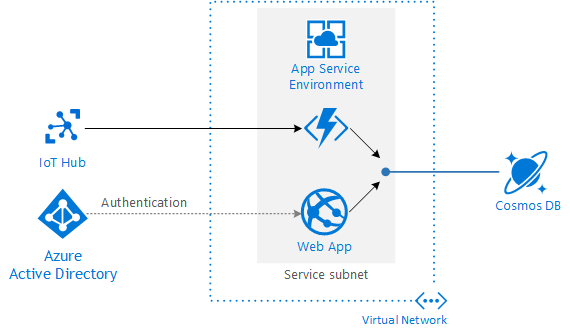
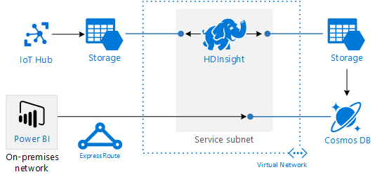

# Threat modeling

This chapter looks at security in the example Drone Delivery IoT application. It describes the threat model that our team performed and the mitigations that we identified. For an overview of using threat modeling in an IoT architecture, see [Internet of Things security architecture](https://docs.microsoft.com/en-us/azure/iot-fundamentals/iot-security-architecture).

Threat modeling is a process to identify potential security threats against a system and correct design-level security problems. There are many ways to perform a threat model. We recommend using the [Microsoft Threat Modeling Tool](https://docs.microsoft.com/en-us/azure/security/azure-security-threat-modeling-tool). This tool is based on the [STRIDE](https://docs.microsoft.com/en-us/azure/security/azure-security-threat-modeling-tool-threats) approach. STRIDE is a mnemonic device for six categoies of threat:  Spoofing, Tampering, Repudiation, Information discosure, Denial of service, and Elecvation of privilege.

## Data flow diageram

Start by decomposing a system into components. Then create a data flow diagram that shows data flows, data stores, processes, interactors (people or entities that interact with the system), and trust boundaries. A trust boundary is a boundary around subsystems that trust one another. Data coming from outisde of the boundary is not trusted unless it has been validated or authenticated. For example, in an IoT solution, there is a trust boundary between devices and the cloud gateway. The cloud gateway shouldn't trust data from a device that is not authenticated, and vice versa. 

The following image shows the data flow diagram for the Drone Delivery application:

## Threat model

The following tables summarize the threat model for the Drone Delivery application. This doesn't capture every possible threat and mitigation, but shows the type of approach you should take.

### Processing (Compute)

| Path | Component / interaction | Threat | Risk | Mitigation |
|------|-----------------------|--------|------|------------|
| Things | IoT devices to IoT Hub | S | Unauthorized device connects to IoT Hub | Device identity and authentication |
| Hot path, warm path, cold path | Message processing | E | SQL injection attacks and other code execution attacks. | Validate input in each path. |

### Communication

| Path | Component / interaction | Threat | Risk | Mitigation |
|------|-----------------------|--------|------|------------|
| Cold path | IoT Hub to Storage | S | Attacker spoofs the cloud gateway and routes data to another endpoint | IoT Hub uses security tokens, which are verified against shared access policies. Grant devices and services the minimum permissions needed. |
| &nbsp; | &nbsp; | T | Attacker tampers with data being written to storage. | Require [secure transfer](https://docs.microsoft.com/en-us/azure/storage/common/storage-require-secure-transfer) in Azure Storage. |
| &nbsp; | &nbsp; | R | Attacker alters or deletes raw device data. | Use [Azure logging and auditing](https://docs.microsoft.com/en-us/azure/security/azure-log-audit) to audit storage account usage. |
| &nbsp; | HDInsight to Storage | S | Attacker spoofs HDInsight credentials. | Join the HDInsight cluster to an [Active Directory domain](https://docs.microsoft.com/en-us/azure/hdinsight/domain-joined/apache-domain-joined-introduction). Follow the principle of least privilege for authorization. |
| &nbsp; | &nbsp; | D | External agent interrupts data flow between storage and the HDInsight cluster. | Deploy the HDInsight cluster to a [virtual network](https://docs.microsoft.com/en-us/azure/hdinsight/hdinsight-extend-hadoop-virtual-network) (VNet) and use VNet [service endpoints](https://docs.microsoft.com/en-us/azure/virtual-network/virtual-network-service-endpoints-overview) to secure the storage account to the VNet. For more information, see [Configure Azure Storage Firewalls and Virtual Networks](https://docs.microsoft.com/en-us/azure/storage/common/storage-network-security). |
| Warm path | Function to Cosmos DB | R | Attacker sends invalid position data to the Function app, which writes the data to Cosmos DB | Log all messages received so there is an audit trail. |
| &nbsp; | &nbsp; | D | External agent interrupts data flow between the Function app and Cosmos DB. | Deploy the Function app to an [App Service Environment](https://docs.microsoft.com/en-us/azure/app-service/environment/intro) (ASE). Use [service endpoints](https://docs.microsoft.com/en-us/azure/virtual-network/virtual-network-service-endpoints-overview) to secure Cosmos DB to the ASE virtual network. |
| &nbsp; | Storage | T | Attacker tampers with data being written to storage. | Require secure transfer in Azure Storage. Use a VNet service endpoint to secure the Storage account to the ASE virtual network. (Note: The Event Hub trigger in Azure Functions uses Storage for checkpointing.) |
| Hot path | Stream Analytics | R | Attacker sends invalid data to Stream Analytics to spoof a sensor anomaly. | Enable diagnostic logs. |
| &nbsp; | Stream Analytics to Cosmos DB  | D | External agent interrupts the flow of data between Stream Analytics and Cosmos DB | Configure Cosmos DB to deny connections from outside the Azure datacenters. See [Azure Cosmos DB firewall support](https://docs.microsoft.com/en-us/azure/cosmos-db/firewall-support#connections-from-global-azure-datacenters-or-azure-paas-services).

### Storage

| Path | Component / interaction | Threat | Risk | Mitigation |
|------|-----------------------|--------|------|------------|
| Hot path | Storage to HDInsight | T | 
| Hot, warm, cold | Storage | S | Attacker obtains access keys | Store access keys in [Azure Key Vault](https://docs.microsoft.com/en-us/azure/key-vault/). Implement scheduled rotation of keys. Never check secrets into source code. |
| &nbsp; | &nbsp; | I | Attacker reads data in storage. | All data written to Azure Storage is [encrypted](https://docs.microsoft.com/en-us/azure/storage/common/storage-service-encryption) automatically. |
| Hot, warm | Cosmos DB | S | Attacker obtains access keys | Store access keys in Key Vault. Implement scheduled rotation of keys. Never check secrets into source code. |
| &nbsp; | &nbsp; | T | Attacker writes to the database. | Use [read-only keys](https://docs.microsoft.com/en-us/azure/cosmos-db/secure-access-to-data#master-keys) or [resource tokens](https://docs.microsoft.com/en-us/rest/api/cosmos-db/access-control-on-cosmosdb-resources) for dashboards or web apps that read from the database. |
| &nbsp; | &nbsp; | I | Attacker reads data in storage. | All data written to Cosmos  DB is [encrypted](https://docs.microsoft.com/en-us/azure/cosmos-db/database-encryption-at-rest) automatically. |
| Cold path | Storage to HDInsight | T | Attacker tampers with raw telemetry data. | Use [shared access signatures](https://docs.microsoft.com/en-us/azure/hdinsight/hdinsight-storage-sharedaccesssignature-permissions) to give HDInsight read-only access to the raw telemetry storage account. |

## Virtual network isolation

One way to reduce the potential attack surface is to isolate components within a virtual network. A virtual network gives you control over the public endpoints, using a combination of NSG rules, [network virtual appliances](../reference-architectures/dmz/secure-vnet-hybrid.md), and [virtual network isolation](https://docs.microsoft.com/en-us/azure/security/azure-isolation#networking-isolation). You can also use VPN gatways or ExpressRoute connections to create a [hybrid network](../reference-architectures/hybrid-networking/index.md) that connects your on-premises network to Azure.

This approach has always been possible when running purely VM-based workloads. [Virtual Network Service Endpoints](https://docs.microsoft.com/en-us/azure/virtual-network/virtual-network-service-endpoints-overview) extends this approach to managed Azure services. Using a VNet service endpoint, you can allow traffic to the service endpoint only from selected virtual networks and subnets. Moreover, traffic from your VNet to the Azure service always remains on the Microsoft Azure backbone network. 

At the time we developed the Drone Delivery reference application, VNet service endpoints were not available for all of the Azure services used. For the most up-to-date notifications, check the [Azure Virtual Network updates page](https://azure.microsoft.com/updates/?product=virtual-network).

### Warm path

For the warm path, it's possible to deploy the Azure Function application into an [App Service Environment](/azure/app-service/environment/intro). This provides a dedicated environment for running a Functions app using an [App Service plan](https://docs.microsoft.com/en-us/azure/azure-functions/functions-scale#app-service-plan). 

Isolate network traffic to Cosmos DB by creating a VNet service endpoint and associate it to the subnet for the App Service Environment. 

The web app that displays the data stored in Cosmos DB is secured using Azure Active Directory (Azure AD) authentication.

### Cold path

A similar approach is possible for the cold path, by [deploying](https://docs.microsoft.com/en-us/azure/hdinsight/hdinsight-extend-hadoop-virtual-network) the HDInsights cluster into a virtual network. Isolate network traffic between the cluster and Azure Storage by creating a VNet service endpoint for Storage. 

Depending on the security requirements, you can also lock down access to the serving layer, which stores the output from the batch processing jobs. In this diagram, Cosmso DB is used as the analytical data store. Users view the data through Power BI from an on-premises network that is connected to Azure through an ExpressRoute circuit. Or you can connect to the [Power BI SaaS application](https://docs.microsoft.com/en-us/power-bi/service-admin-power-bi-expressroute) through ExpressRoute.

### Hot path

Currently, Stream Analytics does not support deploying into a virtual network. However, you can provide some degree of isolation by restricting Cosmos DB to allow connections only from Azure cloud services. For more information, see [Azure Cosmos DB firewall support](https://docs.microsoft.com/en-us/azure/cosmos-db/firewall-support).

The point of this section is not that you must always deploy every security countermeasure described here. Instead, you should evaluate your security requirements based on your particular scenario. For more information about network security in Azure, see 
[Microsoft cloud services and network security](https://docs.microsoft.com/en-us/azure/best-practices-network-security).